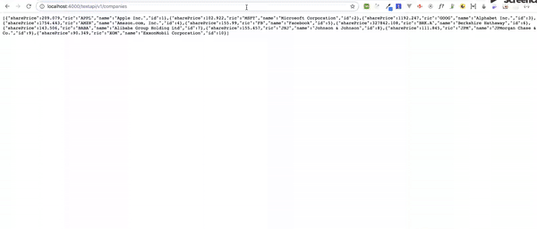

# ElixirNinetyNineBackendChallenge

Project that shows how to build an Elixir API Rest. This project exposes (using REST routes endpoints) the following info using the JSON:API standard:

  * List of companies (http://localhost:4000/testapi/v1/companies)
  * Info by company (http://localhost:4000/testapi/v1/companies/{companyId})
  * Time series of the company share price. It should support hourly, daily and weekly time series.
    -> All http://localhost:4000/testapi/v1/historical
    -> Dayly http://localhost:4000/testapi/v1/historical/{ric}/daily
    -> Weekly Dayly http://localhost:4000/testapi/v1/historical/{ric}/weekly

This project was generated with [MIX](https://elixir-lang.org/getting-started/mix-otp/introduction-to-mix.html).

Technologies: Elixir.

## Demo Example

To start your Phoenix app:

  * Install dependencies with `mix deps.get`
  * Create and migrate your database with `mix ecto.create && mix ecto.migrate`
  * Install Node.js dependencies with `npm install`
  * Start Phoenix endpoint with `mix phoenix.server`

Now you can visit [`localhost:4000`](http://localhost:4000) from your browser.

Ready to run in production? Please [check our deployment guides](http://www.phoenixframework.org/docs/deployment).

## Learn more

  * Official website: http://www.phoenixframework.org/
  * Guides: http://phoenixframework.org/docs/overview
  * Docs: https://hexdocs.pm/phoenix
  * Mailing list: http://groups.google.com/group/phoenix-talk
  * Source: https://github.com/phoenixframework/phoenix
